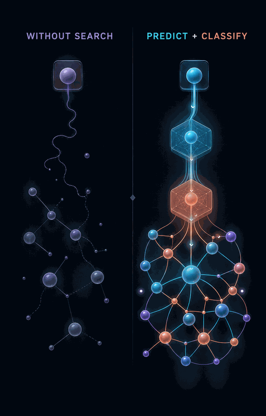

# LinkedIn Motion Kit

A Codex-driven pipeline that turns a plain-English technology concept into original artwork, derives masks and motion paths from that generated image, and renders a polished looping GIF. It does not require you to provide or manually mask a still.

The art direction is called **Midnight Signal**: ink-black editorial backgrounds, glass and anodized-metal forms, cyan/coral/lilac accents, and motion that feels precise rather than hyperactive.


### Landscape example: search versus prediction


## Generate from a brief

Install the bundled Codex skill once:

```bash
python scripts/install_codex_skill.py
```

Then open this repository in Codex and ask:

```text
Use $create-tech-motion to compare two context graphs: one without search,
and one that uses prediction and classification models.
```

Codex will:

1. generate concept-specific artwork with built-in image generation;
2. inspect the actual output and describe its regions as normalized mask primitives;
3. trace visible routes with animation paths;
4. generate the masks and render the final GIF;
5. visually verify the animated result.

The local Python renderer does not call an image API. The Codex skill orchestrates image generation, inspection, mask derivation, and rendering; the Python layer makes those masks and animations deterministic and repeatable.

### Example generated from that brief



## What is included

- A generated abstract-graph base image in `assets/source/`
- A generated two-context-graph comparison and its complete scene preset
- A browser-based paint/erase mask editor in `mask-studio/`
- A bundled `$create-tech-motion` Codex skill for brief-to-GIF generation
- A JSON layer stack with masked glow, masked sheen, path particles, orbits, and finishing effects
- A deterministic Python renderer that creates a seamless looping GIF
- Reusable Codex image-generation prompts for six tech themes in `PROMPTS.md`

## Quick start

```bash
cd /Users/henneberger/linkedin-motion-kit
python3 -m venv .venv
source .venv/bin/activate
pip install -r requirements.txt
python scripts/bootstrap_masks.py
python -m motionkit presets/abstract-graph.json
open output/abstract-graph.gif
```

For a fast iteration:

```bash
python -m motionkit presets/abstract-graph.json --preview -o output/preview.gif
```

## The pipeline

1. **Generate a still with Codex.** The bundled skill turns the brief into a Midnight Signal prompt and saves the generated output into the project.
2. **Derive masks.** Codex inspects that output and adds normalized mask primitives to the scene. The renderer materializes them as PNGs automatically. Mask Studio remains available for optional hand refinement.
3. **Define paths and layers.** Codex traces the actual generated connections and configures glow, sheen, path, and orbit layers.
4. **Render.** Run `python -m motionkit presets/your-scene.json`.
5. **Post.** The default 540×675, 16 fps, 3-second output is deliberately modest in file size and loops cleanly.

Image generation establishes the visual world. Local compositing handles animation, which avoids visual drift between model-generated frames and makes timing, colors, paths, masks, and loops reproducible.

## Layer reference

| Type | Purpose | Important fields |
|---|---|---|
| `masked_glow` | Pulse a node or region | `mask`, `color`, `blur`, `opacity`, `speed`, `offset` |
| `masked_sheen` | Sweep a highlight through glass/metal | `mask`, `color`, `width`, `opacity`, `speed` |
| `flow_path` | Move packets through a connection | `points`, `color`, `particles`, `radius`, `speed`, `offset` |
| `orbit` | Add a scanning/status orbit | `center`, `radius`, `color`, `particles`, `speed` |
| `path_trace` | Progressively illuminate part of a route | `points`, `color`, `length`, `width`, `speed` |
| `scan_line` | Sweep a clipped scanner across a region | `mask`, `axis`, `color`, `width`, `speed` |
| `ripple` | Emit expanding decision/status rings | `center`, `radius`, `count`, `color`, `speed` |
| `masked_particles` | Drift a deterministic particle field inside a mask | `mask`, `direction`, `count`, `seed`, `speed` |

Coordinates are normalized: `[0, 0]` is top-left and `[1, 1]` is bottom-right. A `flow_path` accepts 2 points for a line, 3 for a quadratic curve, or 4 for a cubic Bézier curve.

## A useful layer recipe

For most tech posts, use:

- one slow masked glow on the main subject;
- one quieter, offset glow on secondary objects;
- two to four flow paths with only two or three particles each;
- one masked sheen or orbit as a premium detail;
- a three-second loop with different speeds so the motion does not feel mechanical.

Restraint matters. If every region moves, the graphic reads as an ad. If one relationship moves, it reads as an idea.

## Creating another scene

Copy the preset:

```bash
cp presets/abstract-graph.json presets/ai-inference.json
```

Then replace:

- `name`, `base`, and `output`;
- all mask paths;
- each path's normalized control points;
- accent colors only if the generated still requires it.

Keep the palette, materials, background, and general motion density unchanged across posts. That consistency is what makes a run of otherwise disposable feed graphics feel like a recognizable series.

## Notes

- GIF has a 256-color limit. The renderer quantizes each frame; gradients may show slight banding.
- Keep critical content inside the central 80 percent because social feeds may preview-crop.
- The renderer uses center-crop/cover when the generated still does not exactly match the configured canvas.
- Set `canvas.fit` to `contain` when headings or edge content must be preserved.
- Masks are ordinary grayscale PNG files: white receives the effect, black protects the image, gray gives partial influence.
