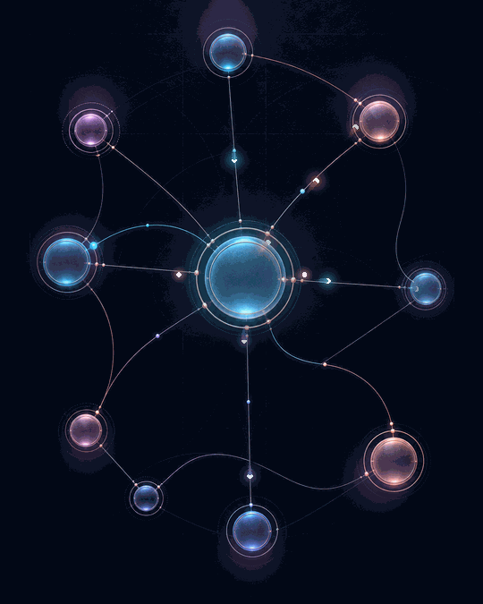

# LinkedIn Motion Kit

A small, local pipeline for turning a Codex-generated tech illustration into a polished looping GIF. The included preset animates an abstract data graph; the same layer stack works for AI, cloud, database, security, and developer-tool visuals.

The art direction is called **Midnight Signal**: ink-black editorial backgrounds, glass and anodized-metal forms, cyan/coral/lilac accents, and motion that feels precise rather than hyperactive.



## What is included

- A generated abstract-graph base image in `assets/source/`
- A browser-based paint/erase mask editor in `mask-studio/`
- A JSON layer stack with masked glow, masked sheen, path particles, orbits, and finishing effects
- A deterministic Python renderer that creates a seamless looping GIF
- Reusable Codex image-generation prompts for six tech themes in `PROMPTS.md`

## Quick start

```bash
cd /Users/henneberger/linkedin-motion-kit
python3 -m venv .venv
source .venv/bin/activate
pip install -r requirements.txt
python scripts/bootstrap_masks.py
python -m motionkit presets/abstract-graph.json
open output/abstract-graph.gif
```

For a fast iteration:

```bash
python -m motionkit presets/abstract-graph.json --preview -o output/preview.gif
```

## The pipeline

1. **Generate a still with Codex.** Start from the style block and one subject module in `PROMPTS.md`. The still should contain clean, traceable routes and isolated regions that can be masked.
2. **Create masks.** Open `mask-studio/index.html`, load the still, paint an animated region, and export the black-and-white PNG into `assets/masks/`.
3. **Define paths and layers.** Duplicate `presets/abstract-graph.json`, point `base` and `mask` entries at your assets, then edit normalized path coordinates.
4. **Render.** Run `python -m motionkit presets/your-scene.json`.
5. **Post.** The default 540×675, 16 fps, 3-second output is deliberately modest in file size and loops cleanly.

Image generation establishes the visual world. Local compositing handles animation, which avoids visual drift between model-generated frames and makes timing, colors, paths, masks, and loops reproducible.

## Layer reference

| Type | Purpose | Important fields |
|---|---|---|
| `masked_glow` | Pulse a node or region | `mask`, `color`, `blur`, `opacity`, `speed`, `offset` |
| `masked_sheen` | Sweep a highlight through glass/metal | `mask`, `color`, `width`, `opacity`, `speed` |
| `flow_path` | Move packets through a connection | `points`, `color`, `particles`, `radius`, `speed`, `offset` |
| `orbit` | Add a scanning/status orbit | `center`, `radius`, `color`, `particles`, `speed` |

Coordinates are normalized: `[0, 0]` is top-left and `[1, 1]` is bottom-right. A `flow_path` accepts 2 points for a line, 3 for a quadratic curve, or 4 for a cubic Bézier curve.

## A useful layer recipe

For most tech posts, use:

- one slow masked glow on the main subject;
- one quieter, offset glow on secondary objects;
- two to four flow paths with only two or three particles each;
- one masked sheen or orbit as a premium detail;
- a three-second loop with different speeds so the motion does not feel mechanical.

Restraint matters. If every region moves, the graphic reads as an ad. If one relationship moves, it reads as an idea.

## Creating another scene

Copy the preset:

```bash
cp presets/abstract-graph.json presets/ai-inference.json
```

Then replace:

- `name`, `base`, and `output`;
- all mask paths;
- each path's normalized control points;
- accent colors only if the generated still requires it.

Keep the palette, materials, background, and general motion density unchanged across posts. That consistency is what makes a run of otherwise disposable feed graphics feel like a recognizable series.

## Notes

- GIF has a 256-color limit. The renderer quantizes each frame; gradients may show slight banding.
- Keep critical content inside the central 80 percent because social feeds may preview-crop.
- The renderer uses center-crop/cover when the generated still does not exactly match the configured canvas.
- Masks are ordinary grayscale PNG files: white receives the effect, black protects the image, gray gives partial influence.
